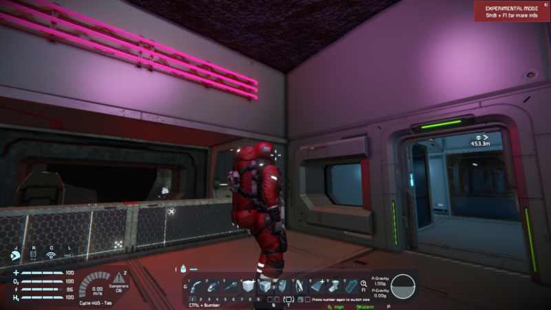

# iv4XR Space Engineers Plugin

A plugin providing integration of **[Space Engineers](https://www.spaceengineersgame.com/)** to the **iv4XR framework**. You can find the project page at [iv4xr-project.eu](https://iv4xr-project.eu/).

Status: Active development (alpha version); high-level architecture is now mostly stable

## Introduction

Space Engineers is a sandbox game by Keen Software House. This project is a plugin for the game which enables its integration with the iv4XR testing framework. The plugin runs a TCP/IP server with JSON-RPC API. It allows to access surrounding of the player's character in a structured form (a World Object Model, WOM) and to control the character. More features such as controlling some of the game screens have been added during the development. 

The project includes a full-featured [client in Kotlin](https://github.com/iv4xr-project/iv4xr-se-plugin/tree/main/JvmClient).

## How to run the game with this plugin

It's not necessary to build anything to try out this plugin. This section describes how to do it.

1. Obtain the binary release of Space Engineers (buy it on Steam or get a key). Install the game.
2. Obtain a binary release of **the plugin**. Look for [releases](https://github.com/iv4xr-project/iv4xr-se-plugin/releases) in this repository and for Assets of the chosen release. Download all the DLL libraries.
   1. If you want the latest changes or you'd like to edit the code, you can also build it from the sources (even if you don't have Space Engineers source code), see the section **How to build** below.
3. IMPORTANT: Make sure Windows is OK to run the libraries. **Windows (10+) blocks "randomly" downloaded libraries.** To unblock them, right-click each of them and open file properties. Look for Security section on the bottom part of the General tab. You might see a message: "*This file came from another computer and might be blocked...*". If so, check the `Unblock` checkbox.
   (If you skip this step, the game will probably crash with a message: `System.NotSupportedException`: *An attempt was made to load an assembly from a network location...*)
4. Obtain other libraries as described in the section **3rd Party Dependencies** below.
5. Put the plugin libraries (and its dependencies) into the folder with the game binaries. A common location is `C:\Program Files (x86)\Steam\steamapps\common\SpaceEngineers\Bin64`.
   Tip: It's you can put the libraries into a subfolder (such as `ivxr-debug`). Or, it can be a symbolic link to the build folder of the plugin project. In that case, you must prefix the name of each library with `ivxr-debug\` in the following step. 
6. Right-click on the game title in the Steam library list and open its properties window. Click on the **Set launch options...** button. Add the option `-plugin` followed by the location of the main plugin library. Library dependencies will be loaded automatically – just make sure they are in the same folder or some other searched location. The resulting options line should look something like this: `-plugin Ivxr.SePlugin.dll`.
7. Run the game. (If the game crashes, make sure you've seen step 3.)
8. If the plugin works correctly, a TCP/IP server is listening for JSON-RPC calls on a fixed port number. (See the config file in user's AppData folder `~\AppData\Roaming\SpaceEngineers\ivxr-plugin.config` for the current port number; the default is 3333).
   Another sign of life is a log file present in the same folder.

#### *3rd Party Dependencies*

Apart from the game libraries, the plugin requires three additional libraries to run:

* `AustinHarris.JsonRpc.dll`, which in turn requires:
* `Newtonsoft.Json.dll`
* `ImpromptuInterface.dll`

There are many ways how to obtain the libraries. For convenience we provide them as special releases in this repository. _They are **not** part of the official releases_ because – among other things – they may have different licenses. Look for "3rd Party Library Dependencies" among releases.

Another way how to get the libraries is the following:

* Check-out the [JSON-RPC.NET master branch on GitHub](https://github.com/Astn/JSON-RPC.NET).
  * *Side note: The binary releases are not updated (compared to NuGet packages), but the the last [release v1.1.74](https://github.com/Astn/JSON-RPC.NET/releases/tag/v1.1.74) works as well. You can try it if the master branch does not.* 
* Build the solution including the test project (tested with Visual Studio 2019).
* You will find the `AustinHarris.JsonRpc.dll` library in this path:
  `Json-Rpc\bin\Debug\netstandard2.0`
* And the `Newtonsoft.Json.dll` library in this path:
  `AustinHarris.JsonRpcTestN\bin\Debug\netcoreapp3.0`

Note: If you build the project from the sources as described in the section **How to Build**, the libraries are downloaded via NuGet packages.

## Protocol and API

The network protocol is based on [JSON-RPC 2.0](https://www.jsonrpc.org/specification). JSON-RPC messages are separated by newlines, TCP is used as the transport layer. The protocol (individual APIs) is now more stable than in the beginning of the development, but it's still possible it will change as we learn new things.

For an up to date list of provided API calls see the interface [ISpaceEngineers](https://github.com/iv4xr-project/iv4xr-se-plugin/blob/main/Source/Ivxr.SpaceEngineers/ISpaceEngineers.cs) in the project **`Ivxr.SpaceEngineers`**. 

You can also check out the [JvmClient](JvmClient/README.md) in this repository for client side implementation of the interface in Kotlin and examples how to use it.

## Game mechanics and functionality

This section links to specific, more detailed parts of the documentation which describe functionality relevant for the plugin:

- [Basic information](JvmClient/docs/Basics.MD) about Space Engineers engine for purposes of using the plugin.
- Information about [blocks](JvmClient/docs/Blocks.MD).
- Information about character/vehicle [movement](JvmClient/docs/Movement.MD).
- Controlling the game using [screens](JvmClient/docs/Screens.MD).
- Using the plugin in [multiplayer](JvmClient/docs/Multiplayer.MD).
- [Block ownership](JvmClient/docs/Ownership.MD).
- [Multiple characters](JvmClient/docs/Multiple-Characters.MD) in a single game.
- Using the plugin for [automated testing](JvmClient/docs/Automated-Testing.MD).
- [JvmClient](JvmClient/README.md) in this repository is a client side implementation of the interface in Kotlin.

## Architecture Overview

Overview of the solution projects:

* **`Ivxr.SePlugin`** – The **main plugin project**. Contains most of the important logic. It is one of the plugin libraries, the main one.
  * See the project details below.
* **`Ivxr.SePlugin.Tests`** – Unit tests for the main project.
* **`Ivxr.PlugIndependentLib`** – Contains service code that is *entirely independent of the Space Engineers codebase* for better dependency management and easier testing.
  * Contains some basic interfaces such as the logging interface.
  * It is a secondary plugin library.
* **`Ivxr.PlugIndependentLib.Test`**
* **`Ivxr.SpaceEngineers`** – Contains **the main interfaces and models of the C# API** which is exposed via JSON-RPC.
  * [ISpaceEngineers](https://github.com/iv4xr-project/iv4xr-se-plugin/blob/main/Source/Ivxr.SpaceEngineers/ISpaceEngineers.cs) – the main interface grouping other interfaces such as `ICharacterController`, `ISpaceEngineersAdmin`, and others.
  * Does not depend on the Space Engineers codebase.
  * The TCP/IP server has now been replaced by the JSON-RPC library.

#### Project details: `Ivxr.SePlugin`

List of notable classes – top level:

* `IvxrPlugin` – Entry point of the plugin, implements the game's `IConfigurablePlugin` and `IHandleInputPlugin` interfaces.
* `IvxrSessionComponent` –  Inherits from game's `MySessionComponentBase` which allows the component to hook the plugin into game events such as `UpdateBeforeSimulation` called each timestep of the game.
* `IvxrPluginContext` – Root of the dependency tree of the plugin, constructs all the important objects.

Notable sub-namespaces (and the solution sub-folders):

* `Control` – Interfacing with the game: Obtaining observation and control of the character. Notable classes:
  * `CharacterController` – Self-explanatory.
  * `Observer` – Extracts observations from the game.
  * `Screens` – Implementation of `IScreens` interface for controlling game screens.
* `Session` – Session control such as loading a saved game. Has a separate command dispatcher because it needs to run (in the "lobby") even when no actual game is running.
* `WorldModel` – Classes supporting the communication (JSON over TCP/IP).
* `Communication` – Classes for JSON-RPC mappings, thread synchronizations and other tools required for the communication.

## Naming convention

The project contains the plugin in C# and a JVM client in Kotlin. Those 2 languages have different naming conventions.

- Properties and methods in C# usually begin with uppercase (`PascalCase`), but they begin with lowercase in
  Kotlin (`camelCase`).
- Interfaces in C# sometimes have "I" prefix to signal interface. We usually refer to interface without the "I" in the
  documentation unless directly referencing a class.
- If you see a reference to a variable or property, always interpret it in the context of the particular language.
- Since the server is implemented in C#, JSON-RPC protocol uses C# conventions and all method names and parameters are
  in `PascalCase`.

## How to build

First of all, you don't *have to* build it from sources. There are also binary releases (but, of course, the code is usually more up to date).

The plug-in requires Space Engineers libraries to compile. There are two ways how to provide the libraries: as binaries (DLLs) or as sources. Both options are described below.

The resulting plug-in (a couple of .NET libraries) works with the official Steam version of Space Engineers without any modification of the game.

### How to build with game binaries

We are developing the plugin using source dependencies; therefore, it is necessary to perform a few steps to switch to binary dependencies: provide the library binaries and switch the references to those binaries. We assume you have installed the official release of the game from Steam.

1. **Obtain the Space Engineers libraries.** Locate the script `copydeps.bat` in the `BinaryDependencies` directory.
    1. If you have your Steam installation of Space Engineers in the default path, then just run the script and the binaries will be copied to the directory. The default path is `C:\Program Files (x86)\Steam\steamapps\common\SpaceEngineers\Bin64`.
    2. If you have SE in some other path, provide it as the first argument to the script. (Or copy the libraries listed in the script manually.)
2. **Switch references from project dependencies to binary ones.** You can do it manually, or you can apply (cherry-pick) a commit pointed to by the branch `binary-deps-switch`. (The particular commit changes as we rebase it on newer history.)
3. **Open the solution and build it.** Find the VS solution file `Iv4xrPluginBinaryDeps.sln` in the `Solutions` folder. It's just a solution containing only the plugin projects, not the SE projects – the switch to the binaries has to be done in each of the projects, as described in the previous step. Open the solution and build it. You can than run the game with the plugin as described above.

### How to build if you have SE sources

There's a VS solution file `SpaceEngineers_ivxr.sln` in this repository (in the `Solutions` folder) that contains the plugin projects as well as Space Engineers projects, some of which are dependencies of the plug-in. For this solution file to work, you need to checkout Space Engineers sources to a specific location relative to this Git repository – the relevant branch (such as "Major") has to be checked-out into a directory called "`se`" located next to the checkout of this Git repository. See the nested list below, which corresponds to the required directory structure:

* `se-plugin` – just a top level directory, can have any name
    * `iv4xr-se-plugin` – a checkout of this Git repository
    * `se` – a checkout of a Space Engineers branch (presumably from it's Subversion repository)

Before starting the build of the solution, make sure a correct build configuration is selected. Either **Debug** or **Release** configuration and the **x64** platform.
