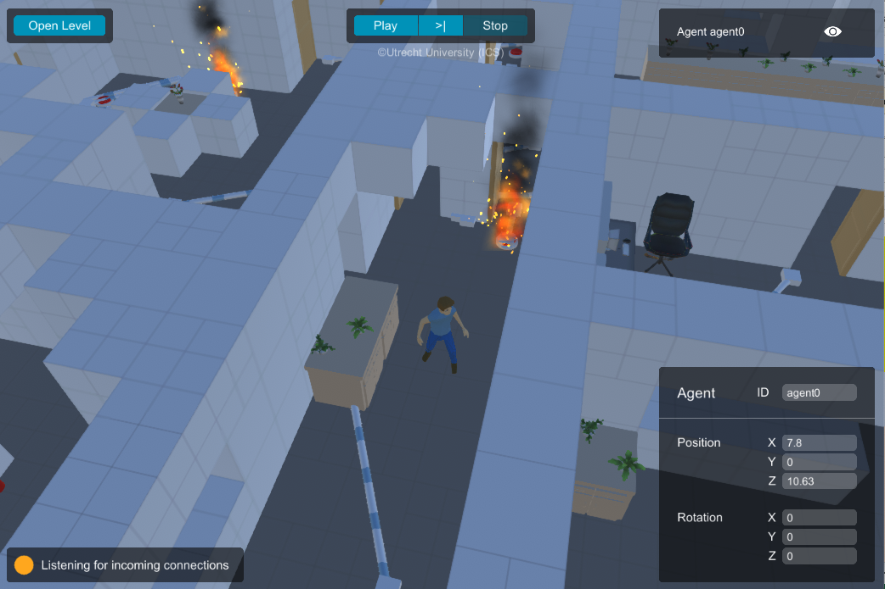
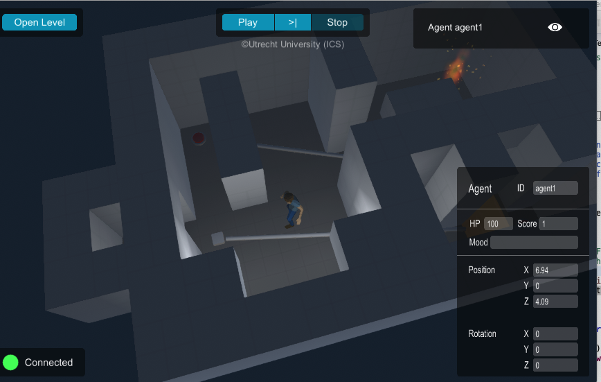

 Space Engineers Demo

This is a demo for the [iv4XR testing framework](https://github.com/iv4xr-project/aplib), demonstrating that iv4XR test agents can control a game called _Space Engineers_ to perform some testing tasks. This repository is a fork of the [*Lab Recruits* demo](https://github.com/iv4xr-project/iv4xrDemo).

It is not intended for general uses yet, other than as a testing project for the development of the [Space Engineers iv4XR plugin](https://github.com/iv4xr-project/iv4xr-se-plugin). For more details please refer to the plugin repository README. 

# Original README content below

This is a demo version 2.x for the [iv4XR Agent-based Testing Framework](https://github.com/iv4xr-project/aplib),
demonstrating that iv4XR test agents can control a game called _Lab Recruits_ to perform testing tasks.
The game executable is no longer included in the repository. It might be included in certain releases, or else you need to build it yourself
from its [repository](https://github.com/iv4xr-project/labrecruits).

You will need correct versions of the iv4XR Framework and the game Lab Recruits, which are compatible with this version of Demo. Check the `pom.xml` to know which versions are needed.

   

**Work in progress notice.** Keep in mind that the work here is still in progress. Things may look ugly while we are working on them, and things may change.

**What is the demo?** A set of JUnit test classes demonstrating how iv4xr test agents are used to implement a number of testing tasks for the game _Lab Recruits_. These classes are located in `src/test/java/agents/demo`. You can simply run them, or modify them yourself. When you run them you don't usually see anything because the tests run pretty fast. You can insert pause-points yourself (e.g. using console-read).

**The Lab Recruits Game.** It is a 3D game (a screenshot is shown above) written for the purpose of testing AI (like the AI of our iv4xr test agents). It features custom level that you can define yourself through a CSV file. Keep in mind that the game is also work in progress. More about this game can be found in its [repository](https://github.com/iv4xr-project/labrecruits).

### Deploying the demo

Build an executable of the [Lab Recruits](https://github.com/iv4xr-project/labrecruits). To do this you can clone or download the source code of this game. Open the project in Unity (note the specific version it needs) and build the executable from there.

For Mac: put the produced `LabRecruits.app` in `gym/Mac/bin`. For Windows: put the produced files including `LabRecruits.exe` in `gym/Windows/bin`.

The demo classes are in `src/test/java/agents/demo`. The demos are by default non-visual (you don't literally see the game runs). Set the variable `TestSettings.USE_GRAPHICS` in the corresponding demo-class to `true` if you want it to be visual.

* Eclipse

   This will allow you to run/modify/rerun the demo classes. Import the project into Eclipse as a **maven project**. The demo classes are in `src/test/java/agents/demo`. You can run them as junit tests.

* Maven

   This is if you just want to check that the project builds and that all its tests pass.
   Just do `mvn compile` and `mvn test` at the project root.

### Other documentations

* For iv4xr team: [World Object Model](./docs/Observation.md)
* For iv4xr team: [where to find goals and tactic](./docs/LRtestingLib.md)
* For others: [basic interface to control _Lab Recruits_](./docs/BasicInterface.md)

### What's in the package

* `./src` the source files. It follows Maven's convention, so the root of the source files is in `src/main/java` and the root of tests' source files is in `src/test/java`.
* `./gym` contains the binary of the _Lab Recruits_ game (macos and windows).
* `./src/test/resources/levels` contain sample level definitions for _Lab Recruits_.

### Contributors

**Computer Science students from Utrecht University:**
Adam Smits,
August van Casteren,
Bram Smit,
Frank Hoogmoed,
Jacco van Mourik,
Jesse van de Berg,
Maurin Voshol,
Menno Klunder,
Stijn Hinlopen,
Tom Tanis.
**Others:** Wishnu Prasetya, Naraenda Prasetya.
